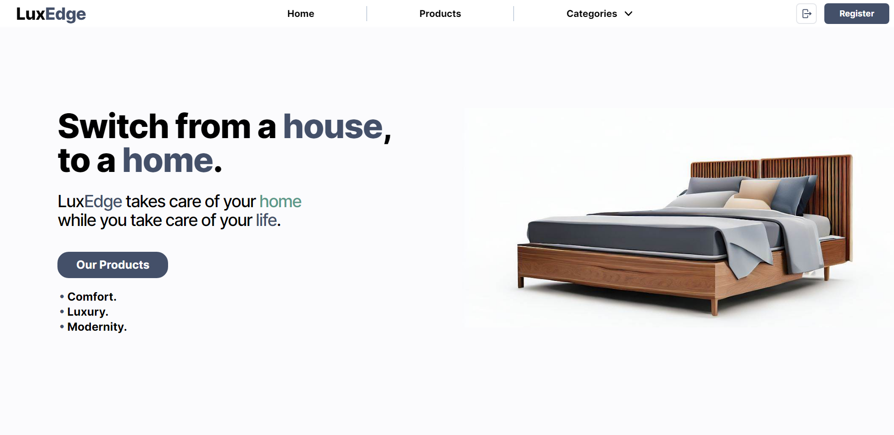
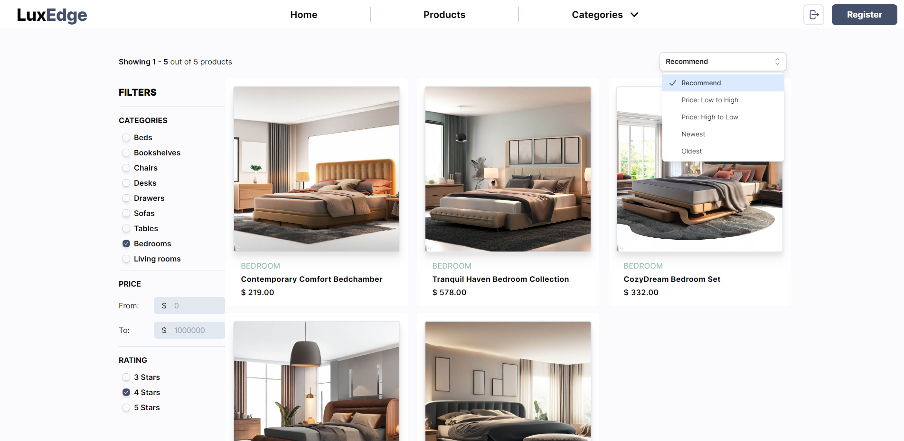

# LuxEdge 🛋️

LuxEdge is a furniture e-commerce template built with React.js, Node.js and TypeScript. It's a fully responsive website, with a clean and modern design. It's also fully customizable, so you can easily change the colors and the content of the website.

## Back-End

The backend is built with Node.js (TypeScript) using:

-   [Express](https://expressjs.com/)
-   [Cors](https://www.npmjs.com/package/cors)
-   [MongoDB](https://www.mongodb.com/)
-   [mongoose](https://mongoosejs.com/)
-   [dotenv](https://www.npmjs.com/package/dotenv)
-   [nodemailer](https://nodemailer.com/about/)
-   [bcrypt](https://www.npmjs.com/package/bcrypt)
-   [jsonwebtoken](https://www.npmjs.com/package/jsonwebtoken)
-   [curse-filter](https://www.npmjs.com/package/curse-filter)
-   [uuid](https://www.npmjs.com/package/uuid)
-   [helmet](https://www.npmjs.com/package/helmet)
-   [node-cron](https://www.npmjs.com/package/node-cron)
-   [stripe](https://stripe.com/docs/api)
-   [zod](https://zod.dev/)

<table style="width: 100%; border: none; margin: 2rem 0" cellspacing="0" cellpadding="0" border="0">
    <tr>
        <td style="width: 50%; border: none!important;" valign="center">
            
        </td>
        <td style="width: 50%; border: none!important;" valign="center">
            
        </td>
    </tr>
<table>

## React App Scripts

In the project directory, you can run:

### `npm run dev`

Runs the app in the development mode on port 5000.

### `npm run build`

Builds the app for production to the `dist` folder.

### `npm start`

Runs the app in the production mode.

   

## About me 🧙‍♂️

I'm Alex 🪐, a highschool student from Italy. I'm a self-taught developer and I'm currently studying web development, using React ⚛️, NodeJS and Typescript.
I always try to learn the newest technologies and I'm always open to new ideas and projects. Fell free to contact me for any questions or suggestions.  Get to know me at alessandrofoglia07@gmail.com!

### 🛠️ Technologies I use the most 🛠️

